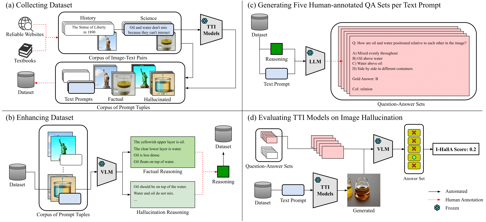
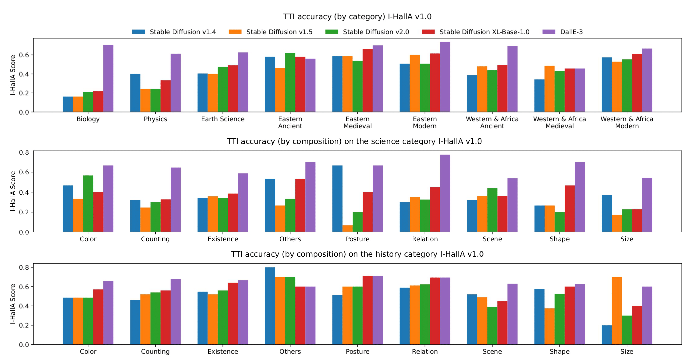
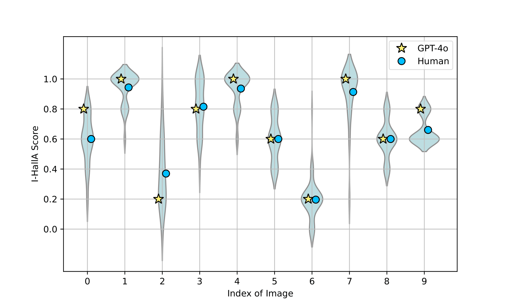

<h2 align="center">
    Evaluating Image Hallucination in Text-to-Image Generation with Question-Answering
</h2>
<h5 align="center">
    Youngsun Lim<sup>1 *</sup>, Hojun Choi<sup>1 *</sup>, Hyunjung Shim<sup>1</sup><br>
    (* indicates equal contributions)<br>
    <sup>1</sup>Graduate School of Artificial Intelligence, KAIST, Republic of Korea<br>
    <code>{youngsun_ai, hchoi256, kateshim}@kaist.ac.kr</code><br>
    <!-- <a href="https://arxiv.org/pdf/2203.11876.pdf">arXiv</a> |
    <a href="https://www.mmlab-ntu.com/project/ovdetr/index.html">Project Page</a> |
    <a href="https://github.com/yuhangzang/OV-DETR">Code</a> -->
</h5>

<h4 align="center">

[](https://arxiv.org/abs/2409.12784)
[](https://openreview.net/forum?id=RPsdiVnG9C)


<div align="center">
    <!--  -->
    
    <!--  -->
</div>


<!-- This is the official implementation of I-HallA-v1.0. -->

</h4>

---

<!-- ## Evaluating Image Hallucination in Text-to-Image Generation with Question-Answering -->

<br/>

### I-HallA-v1.0
Despite the huge success of text-to-image (TTI) generation models, existing studies seldom consider whether generated images accurately represent factual information. In this paper, we define the problem of image hallucination as the generated images fail to accurately depict factual information. To address this, we introduce I-HallA (Image Hallucination evaluation with Question Answering), an automatic evaluation metric that measures the factuality of generated images through visual question answering (VQA), and I-HallA v1.0, a curated benchmark dataset. We develop a three-stage pipeline that generates curated question-answer pairs using multiple GPT-4 Omni-based agents with human judgments. Our evaluation protocols measure image hallucination by testing if images from existing text-to-image models can correctly answer these questions. The I-HallA v1.0 dataset comprises 1.2K diverse image-text pairs across 9 categories with varying levels of difficulty and 1,000 questions covering 9 compositions. We evaluate 5 different text-to-image models using I-HallA and demonstrate that these state-of-the-art models often fail to accurately convey factual information. Additionally, we establish the validity of our evaluation method through human evaluation, yielding a Spearman's correlation of 0.95. We believe our benchmark dataset and metric can serve as a foundation for developing factually accurate text-to-image generation models.

<div align="center">
    <!--  -->
    
    
    
</div>

<br/>

### Updates

- [o] [2024.12.16] 👨‍💻 The official codes have been released!
- [o] [2024.12.10] 🎉 Our paper has been accepted to [AAAI 2025](https://openreview.net/group?id=AAAI.org/2025/Conference#tab-accept)!
- [o] [2024.09.19] 📄 Our paper is now available! You can find the paper [here](https://arxiv.org/abs/2409.12784).


<br/>


### Quick Links
- [Installation](#Installation)
- [Data Preparation](#data-preparation)
- [Quick Start](#quick-start)
- [I-HallA v1.0 Benchmark](#tifa-v10-benchmark)
- [VQA modules](#vqa-modules)

---

## Installation

Clone and build the repo:
```bash
git clone https://github.com/hchoi256/I-HallA-v1.0.git
cd I-HallA-v1.0
pip install -r requirements.txt
```

---

## Data Preparation (We have included links to each of our benchmark datasets.)
- Prepare the **image data** for the I-HallA v1.0 benchmark from [models/](https://drive.google.com/drive/folders/1Me--5W0iyAHarLztLznpgyACKXSyyHIC?usp=sharing). 
- Obtain the **caption data** for the I-HallA v1.0 benchmark from [captions.xlsx](https://docs.google.com/spreadsheets/d/1QdIse3GloFp7HkwoFmK_L3zHZkODoE11N1jIt6O_NAc/edit?usp=sharing).
- Obtain the **QA sets** for the history domain on the I-HallA v1.0 benchmark from [LV_reasoning_history.xlsx](https://docs.google.com/spreadsheets/d/146LXyXh8ivRz_psXU1mY3iMUgMZIh1hadOhnkiM_jUE/edit?usp=sharing)
- Obtain the **QA sets** for the science domain on the I-HallA v1.0 benchmark from [LV_reasoning_science.xlsx](https://docs.google.com/spreadsheets/d/1H7DSbVBOzzKMsUoI_u-64bSZiR510Ags/edit?usp=sharing&ouid=101767653636716697046&rtpof=true&sd=true)
- Obtain the **reasoning data** for the history domain on the I-HallA v1.0 benchmark from [GPT4o_QA_history_mod_cois.xlsx](https://docs.google.com/spreadsheets/d/1HS52GVFosc9NaSgINgupSPo4OkaOQiRr/edit?usp=sharing&ouid=101767653636716697046&rtpof=true&sd=true)
- Obtain the **reasoning data** for the science domain on I-HallA v1.0 benchmark from [GPT4o_QA_science_mod_cois.xlsx](https://docs.google.com/spreadsheets/d/1Zz_13Fqe7jAadUCcFAg5dtPMm9xxgd99/edit?usp=sharing&ouid=101767653636716697046&rtpof=true&sd=true)

Then, put them under `data/`
The data structure looks like:

```text
data/
├── LV_reasoning_history.xlsx
├── LV_reasoning_science.xlsx
├── GPT4o_QA_science_mod_cois.xlsx
├── GPT4o_QA_history_mod_cois.xlsx
├── captions.xlsx
├── models
│   ├── dalle-3
│   │   ├── history
│   │   │   ├── normal
│   │   │   ├── weird
│   │   ├── science
│   │   │   ├── normal
│   │   │   ├── weird
│   ├── sd-v1-4
│   │   ├── history
│   │   │   ├── weird
│   │   ├── science
│   │   │   ├── weird
│   ├── sd-v1-5
│   │   ├── history
│   │   │   ├── weird
│   │   ├── science
│   │   │   ├── weird
│   ├── sd-v2-0
│   │   ├── history
│   │   │   ├── weird
│   │   ├── science
│   │   │   ├── weird
│   ├── sd-xl
│   │   ├── history
│   │   │   ├── weird
│   │   ├── science
│   │   │   ├── weird
```

---

## Quick Start
The following is a quick start guide for evaluating the Image Hallucination scores of five different TTI generation models.
Our method requires the GPT-4o API for evaluation.

### Steps:

1. **Enter your API_KEY in `run.py`:**

    ```python
    YOUR_API_KEY = "[YOUR_API_KEY]"
    ```

2. **Specify the type of TTI generation model to evaluate in `EvaluationAgent.py`:**

    ```python
    payload = {
        "model": "[YOUR_MODEL]",
        "messages": [
        {
            "role": "user",
            "content": [
            {
                "type": "text",
                "text": ""
            },
            ]
        }
        ],
    }
    ```

    ```python
    self.model_version = "YOUR_TTI_MODEL"  # Options: "dalle-3", "sd-v1-4", "sd-v1-5", "sd-v2-0", "sd-xl"
    self.image_type = "weird"
    ```

    To evaluate factual images collected from textbooks, use the following settings:

    ```python
    self.model_version = "dalle-3"
    self.image_type = "normal"
    ```

3. **Choose a `<CATEGORY>` to evaluate in `run.py` and execute the following command:**

    ```bash
    python run.py --category <CATEGORY> --agent_name EvaluationAgent
    ``` 

### Evaluating on any TTI models
In addition to the five TTI generation models we evaluated, our benchmark also supports the evaluation of other TTI models.  
To do this, follow these steps:

1. **Load the [captions.xlsx](https://docs.google.com/spreadsheets/d/1QdIse3GloFp7HkwoFmK_L3zHZkODoE11N1jIt6O_NAc/edit?usp=sharing)** file and input the prompts for each domain into your TTI model.  
   Use the output to generate the data structure described [here](#data-preparation).

2. **Follow the instructions in the [Quick Start](#quick-start)** guide and update the TTI model name to the appropriate one for your evaluation.

---

## I-HallA v1.0 Benchmark
Our method uses a **multi-agent design** to create a benchmark for **Image Hallucination evaluation**.  
Set up and run the agents using the following command:

```bash
python run.py --category <CATEGORY> --agent_name <AGENT>
```

---

### 1. **Data Reasoning Extraction Stage**:

- **`ImageAgent.py`**: The VLM determines whether an input image is "normal" or "weird" with reasoning.  
    - **`ReasoningAgent.py`**: The VLM provides the reasoning behind its "normal" or "weird" determination for the input image.  
- **`CategoryAgent.py`**: The VLM determines the **category** for the given captions.  
- **`CoIAgent.py`**: The VLM identifies the **Composition of Interest** for the given captions.  

The data extracted by these agents is aggregated and integrated into the following files:  

- [LV_reasoning_history.xlsx](https://docs.google.com/spreadsheets/d/146LXyXh8ivRz_psXU1mY3iMUgMZIh1hadOhnkiM_jUE/edit?usp=sharing)  
- [LV_reasoning_science.xlsx](https://docs.google.com/spreadsheets/d/1H7DSbVBOzzKMsUoI_u-64bSZiR510Ags/edit?usp=sharing&ouid=101767653636716697046&rtpof=true&sd=true)  

### 2. **QA Sets Generation Stage**:

- **`QAAgent.py`**: Generates the Question-Answer (QA) sets.

### 3. **Evaluation Stage**:

- **`EvaluationAgent.py`**: Performs the evaluation process.

---

## VQA Modules
We provide an easy interface to perform **VQA (Visual Question Answering)** inference.  
The supported image-to-text models include:  
- `blip2-opt-2.7b`  
- `instructblip-vicuna-7b`  
- `llava-v1.6-34b-hf`  

You can also **customize your own VQA models** by creating a file in the `vlms/<YOUR_MODEL>.py` directory.

### Steps to Perform Inference:

1. Follow the **[Quick Start](#quick-start)** guide for **data preparation** and proper directory settings in the Python files.  
2. Run the following command to execute inference:

   ```bash
   python vlms/<VQA_MODEL>.py
   ```

Replace `<VQA_MODEL>` with the name of your desired VQA model, such as `blip2`, `instructblip`, and `llava2`.

---

## Citation
If you find our work helpful, please cite us:

```bibtex
@article{ihalla,
  author       = {Youngsun Lim and
                  Hojun Choi and
                  Hyunjung Shim},
  title        = {Evaluating Image Hallucination in Text-to-Image Generation with Question-Answering},
  journal      = {CoRR},
  year         = {2024},
}
```


### Acknowledgement

We would like to sincerely thank their contributors, including [GPT-4o](https://openai.com/index/hello-gpt-4o/), for their invaluable contributions.
